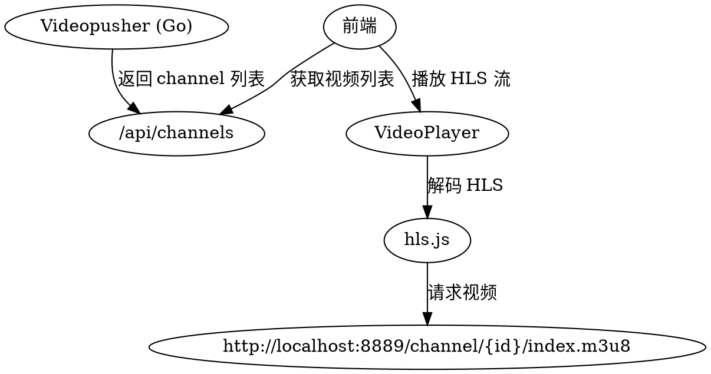

# 视频推流与前端集成设计

**Date:** 2026-03-29
**Project:** skybrain (videopusher + skybrain-web)
**Status:** Draft

## 背景

videopusher 后端已实现动态扫描 videos 目录并自动分配 channel。前端需要接入这些视频流，实现：
1. 5 个场景页面（饭堂、街道商铺、宿舍、教学楼、校门）的视频播放
2. 多路监控页面 9 个无人机的视频分配

## 当前视频资源

共 10 个视频文件：
| Channel ID | 路径 | 场景 |
|------------|------|------|
| 1 | videos/AB.mp4 | 根目录 |
| 2 | videos/H中午.mp4 | 根目录 |
| 3 | videos/IMG_2513.mp4 | 根目录 |
| 4 | videos/操场.mp4 | 根目录 |
| 5 | videos/早八操场.mp4 | 根目录 |
| canteen/1 | videos/canteen/AB2.mp4 | 饭堂 |
| street/1 | videos/street/h栋下午.mp4 | 街道商铺 |
| dormitory/1 | videos/dormitory/十点操场.mp4 | 宿舍区域 |
| building/1 | videos/building/操场2.mp4 | 教学楼 |
| gate/1 | videos/gate/星光大道2.mp4 | 校门通行 |

## 需求

### 1. 后端 API

新增 `GET /api/channels` 接口，返回所有可用视频 channel：

```json
{
  "channels": [
    { "id": "1", "name": "AB.mp4", "scene": "root" },
    { "id": "2", "name": "H中午.mp4", "scene": "root" },
    { "id": "3", "name": "IMG_2513.mp4", "scene": "root" },
    { "id": "4", "name": "操场.mp4", "scene": "root" },
    { "id": "5", "name": "早八操场.mp4", "scene": "root" },
    { "id": "canteen/1", "name": "AB2.mp4", "scene": "canteen" },
    { "id": "street/1", "name": "h栋下午.mp4", "scene": "street" },
    { "id": "dormitory/1", "name": "十点操场.mp4", "scene": "dormitory" },
    { "id": "building/1", "name": "操场2.mp4", "scene": "building" },
    { "id": "gate/1", "name": "星光大道2.mp4", "scene": "gate" }
  ]
}
```

### 2. 前端依赖

添加 `hls.js` 依赖用于播放 HLS 流：
```bash
bun add hls.js
```

### 3. 场景页面

5 个场景页面（canteen, street, dormitory, building, gate）：
- 调用 `/api/channels` 获取视频列表
- 过滤对应 scene 的 channel
- 随机选择 1 个视频播放
- 视频 URL 格式：`http://localhost:8889/channel/{channelId}/index.m3u8`

### 4. 多路监控页面

9 个无人机：
- 调用 `/api/channels` 获取视频列表
- 随机打乱 channels 数组
- 取前 9 个分配给无人机（确保不重复）
- 每个无人机播放对应的 HLS 流

## 实现任务

### 后端 (Go)

1. 新增 `/api/channels` 路由处理函数
2. 返回 JSON 格式的 channel 列表
3. 添加 CORS 支持

### 前端 (React)

1. 添加 hls.js 依赖
2. 新增 `useVideoChannels` hook
3. 改造 `VideoPlayer` 组件支持 HLS 播放
4. 改造场景页面（5个）使用 HLS 视频
5. 改造多路监控页面随机分配视频

## 架构图



## 视频 URL 格式

- 基础URL：`http://localhost:8889`
- Channel 路径：`/channel/{channelId}/index.m3u8`
- 示例：
  - `/channel/1/index.m3u8`
  - `/channel/canteen/1/index.m3u8`

## 随机分配逻辑

### 场景页面

```typescript
// 伪代码
const channels = await fetchChannels()
const sceneChannels = channels.filter(c => c.scene === targetScene)
const randomChannel = sceneChannels[Math.floor(Math.random() * sceneChannels.length)]
```

### 多路监控

```typescript
// 伪代码
const channels = await fetchChannels()
// Fisher-Yates 洗牌算法
const shuffled = shuffle(channels.slice())
const assignedDrones = shuffled.slice(0, 9)
```

## 错误处理

- API 请求失败：显示占位符，显示"视频加载失败"
- HLS 流加载失败：显示"信号中断"提示
- 无可用视频：显示占位图

## 验收标准

1. ✅ 后端 `/api/channels` 返回正确的 JSON 格式
2. ✅ 5 个场景页面能播放对应场景的视频
3. ✅ 多路监控 9 个无人机各自播放不同的视频流
4. ✅ 刷新页面时随机分配结果会变化
5. ✅ 视频加载失败时显示友好提示